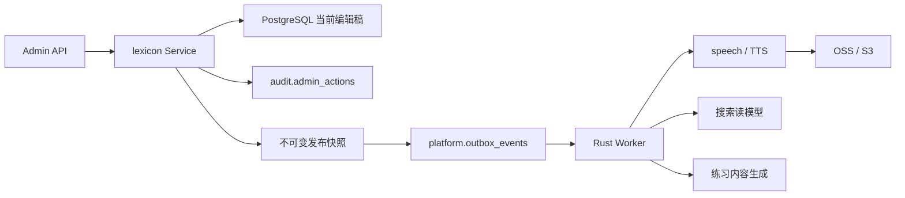
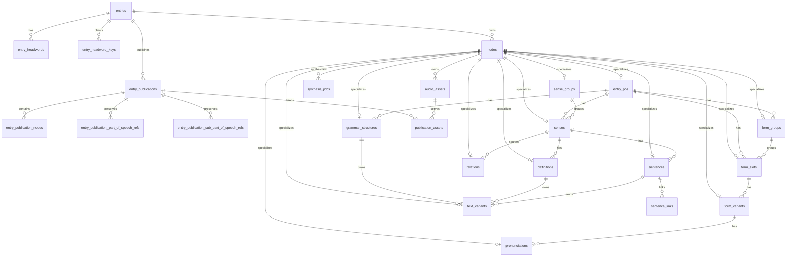

# 智能词库后端架构与数据模型

> 状态：核心词条、词形、词义、关系、发布与治理所需的数据库迁移及 Rust API 已实现；
> Worker、TTS、搜索/练习投影等异步派生能力仍待后续阶段实现。
>
> 本文以 `tsz-rust` 为唯一后端基线，不兼容、复刻或迁移 `tsz-go` 的接口与表结构。
> 前端现有 V2 创编流程和语音富文本编辑能力是产品输入，不是后端实现约束；最终契约以
> `tsz-rust/docs/openapi.json` 为准。

## 1. 结论与架构决策

智能词库首期采用 **Rust 模块化单体 + PostgreSQL + 独立 Worker**：

- `tsz-rust` 单个仓库、单个业务数据库，不在首期拆微服务；
- API 进程负责管理员创编、校验、查询和发布事务；
- Worker 负责 TTS、搜索投影、练习内容生成等异步派生任务；
- PostgreSQL 是业务真相源；
- Redis 只保存短期检测上下文、限流和临时缓存，不保存词条真相；
- OSS/S3 兼容对象存储保存音频文件，数据库只保存 `object_key`；
- 词条关系表保存当前编辑稿，发布时生成不可变快照；
- 学习端只消费明确的发布版本，不读取管理员正在修改的草稿；
- 通过事务 Outbox 保证“发布成功”和“派生任务一定可见”原子一致；
- 业务操作审计、程序诊断日志和异步领域事件分别建模，不能混为一类日志。

首期产品范围仍可只开放：

- `language = en`；
- `kind = word`；
- 管理员维护标准智能词库；
- `draft -> published`；

但数据库根实体使用 `entry` 而不是 `word`，并预留 `phrase`、发布后继续编辑和多次发布，避免
下一阶段重新拆表。

## 2. 领域边界

### 2.1 `dictionary`：内置参考词典

现有 `dictionary.*` 保持独立：

- 保存按版本导入的参考词典、地区词形和来源证据；
- 服务于词头检测、词形建议和英美差异判断；
- 数据集整体切换，业务侧只读；
- 不与智能词库词条建立数据库外键；
- 创建草稿时把实际采用的检测证据复制为快照，之后不依赖原数据集继续存在。

### 2.2 `catalog`：词性与平台目录

维护基本词性和细分词性：

- `lexicon` 通过稳定 UUID 外键引用目录；
- wire 层可继续暴露稳定 `code`；
- 改展示名称不修改词条 revision；
- 当前草稿关系表和仍保留的 publication 引用表都使用数据库外键，阻止删除目录项后产生悬空
  code；
- 具体表结构和接口以 [part-of-speech-config-design.md](part-of-speech-config-design.md) 为准。

### 2.3 `lexicon`：智能词库创编与发布

负责：

- 词条聚合和全部稳定内容节点；
- 草稿步骤保存、并发控制和结构影响检查；
- RichText 规范化与业务校验；
- 关联词、例句链接和稳定词义引用；
- 发布完整性检查；
- 不可变发布版本；
- 向 Outbox 写入领域事件。

### 2.4 `speech`：语音合成与音频资产

负责：

- 发音人能力目录；
- RichText 到 SSML 的服务端权威转换；
- 临时试听缓存；
- 正式音频合成任务；
- 内容变更后的音频失效判断；
- 对象存储和短期签名 URL。

### 2.5 `platform` / `audit`：基础能力

- `platform.idempotency_records`：非天然幂等命令的请求去重；
- `platform.outbox_events`：事务内领域事件；
- `audit.admin_actions`：管理员业务操作审计。

词表、用户自建词库、审批和练习引擎是后续独立领域，只引用已发布词条或发布版本，不直接修改
`lexicon` 的创编关系表。

## 3. Rust 模块结构

沿用项目现有“业务模块垂直切片”规范，不引入不必要的多 crate 或 Repository trait：

```text
src/
├── lexicon/
│   ├── mod.rs
│   ├── router.rs          # /api/v1/admin/lexicon
│   ├── handler.rs         # 鉴权、DTO 解析、HTTP 映射
│   ├── dto.rs             # HTTP wire 类型，不与 SQL Row 共用
│   ├── model.rs           # 聚合、值对象、领域枚举
│   ├── normalization.rs   # 词头与 RichText canonicalization
│   ├── validation.rs      # 草稿/发布纯业务校验
│   ├── repository.rs      # sqlx 查询与事务内持久化
│   ├── service.rs         # create/save/get/list 等用例
│   └── publication.rs     # validate/publish/版本快照
├── catalog/
│   ├── model.rs
│   ├── repository.rs
│   ├── service.rs
│   ├── handler.rs
│   └── router.rs
├── speech/
│   ├── model.rs
│   ├── provider.rs        # TTS Provider trait
│   ├── object_store.rs    # ObjectStore trait
│   ├── repository.rs
│   ├── service.rs
│   ├── handler.rs
│   └── router.rs
├── outbox/
├── audit/
└── bin/
    └── worker.rs
```

约束：

- Handler 中不写 SQL、不拼发布规则；
- Service 开启事务并编排 Repository；
- Repository 的事务方法接收 `&mut PgConnection`，保证一次聚合写入只使用一个事务；
- HTTP DTO、领域模型、SQL Row 分离，禁止直接把数据库 Row 序列化成 API；
- 数据库 Repository 使用具体类型；只在 TTS、对象存储等外部边界使用 trait，方便测试替换；
- 纯规范化和校验函数不依赖 Axum、SQLx、Redis，便于高覆盖率单测。

## 4. 数据流总览





## 5. `catalog` 依赖

词性配置先作为简单独立模块落地，权威设计见
[part-of-speech-config-design.md](part-of-speech-config-design.md)。首期只包含：

- `catalog.metadata`：完整目录版本；
- `catalog.parts_of_speech`：基本词性；
- `catalog.sub_parts_of_speech`：细分词性。

`lexicon.entry_pos` 使用 UUID 外键引用基本词性，`lexicon.senses` 使用 UUID 外键引用细分词性；
API 继续暴露不可修改的稳定 code。

具体节点表只保存 active draft，因此上述两个 FK 只能保护当前草稿，不能保护管理员从新草稿中
移除、但仍存在于当前或历史 publication 的词性。发布事务必须同步写入
`entry_publication_part_of_speech_refs` 和 `entry_publication_sub_part_of_speech_refs`；两表继续以
`ON DELETE RESTRICT` 引用 catalog。只要 publication 仍保留，其 catalog 引用就必须保留。
完整规则见词性配置设计 §10。供应商词性映射属于后续内置词典适配，不进入首期词性配置。

## 6. `lexicon` 聚合根与词头

### 6.1 `lexicon.entries`

词条聚合根只保存身份、并发、流程和列表高频字段：

| 字段 | 类型 | 说明 |
| --- | --- | --- |
| `id` | UUID PK | 服务端 UUID v7 |
| `content_schema_version` | SMALLINT | 首期为 `2` |
| `language` | TEXT | 首期为 `en` |
| `kind` | TEXT | `word` / `phrase` |
| `revision` | BIGINT | 从 1 开始，每次有效草稿写入加一 |
| `headword_mode` | TEXT | `unified` / `distinguish` |
| `source_dialect` | TEXT NULL | distinguish 时为管理员决定的主词侧 `uk` / `us`；不要求等于词典命中方言 |
| `frequency` | NUMERIC(5,2) NULL | 0–100；是否保留两位精度见 §17 |
| `detection_snapshot` | JSONB | 创建时采用的不可变检测证据 |
| `current_publication_id` | UUID NULL | 学习端当前消费的发布版本 |
| `draft_based_on_publication_id` | UUID NULL | 当前编辑稿基于哪个版本开始编辑 |
| `created_by_admin_id` | UUID FK | 创建人 |
| `updated_by_admin_id` | UUID FK | 最后修改人 |
| `created_at` / `updated_at` | TIMESTAMPTZ | 时间 |
| `archived_at` | TIMESTAMPTZ NULL | 已发布词条不物理删除 |
| `archived_by_admin_id` | UUID FK NULL | 归档人 |

不保存单一的 `draft/published` 状态作为业务真相，状态由字段派生：

- `current_publication_id IS NULL`：未发布草稿；
- 当前发布版本的 `source_revision = revision`：已发布且无新修改；
- `revision > current publication.source_revision`：已有未发布修改；
- `archived_at IS NOT NULL`：已归档，对学习端不可见。

这样已发布内容可以继续在线服务，同时管理员编辑下一版。`current_publication_id` 的外键在
`entry_publications` 建表后补充，并使用 entry ID 组成复合外键，保证
`current_publication_id`、`draft_based_on_publication_id` 不会指向其他词条的发布版本。

### 6.2 `lexicon.entry_headwords`

保存真实业务语义，不为了查重而重复存两份：

| 字段 | 类型 | 说明 |
| --- | --- | --- |
| `id` | UUID PK | 稳定词头行 ID |
| `entry_id` | UUID FK | 所属词条 |
| `dialect` | TEXT | `common` / `uk` / `us` |
| `headword` | TEXT | 展示值 |
| `normalized_headword` | TEXT | 统一规范化结果 |
| `normalization_version` | SMALLINT | 规范化规则版本 |
| `origin` | TEXT | `dictionary` / `converted` / `manual` |

唯一约束：`(entry_id, dialect)`。

- unified 必须恰好一行 `common`；
- distinguish 必须恰好一行 `uk` 和一行 `us`；
- 形状完整性由 Rust 服务校验。

### 6.3 `lexicon.entry_headword_keys`

独立保存用于查重的“方言作用域声明”：

| 字段 | 类型 | 说明 |
| --- | --- | --- |
| `entry_id` | UUID FK | 所属词条 |
| `language` | TEXT | 冗余用于唯一索引 |
| `kind` | TEXT | 冗余用于唯一索引 |
| `dialect_scope` | TEXT | 物理值只允许 `uk` / `us` |
| `normalized_headword` | TEXT | 规范化查重键 |
| `normalization_version` | SMALLINT | 规则版本 |

主键：`(entry_id, dialect_scope)`。

唯一索引：

```text
(language, kind, dialect_scope, normalized_headword)
```

`normalization_version` 用于审计和重算，不进入唯一索引，否则不同规则版本会允许重复词并存。
切换规范化规则前必须离线重算全部 active key、报告冲突并原子激活新规则，不能长期混用规则。

unified 词头展开为 UK、US 两个查重键；distinguish 分别写入各自方言键。这样可以阻止
`common color` 与另一个词条的 `us color` 绕过重复检查，同时不污染真实词头存储。

归档词条默认继续占用查重键，避免同一稳定词头被第二个 entry 重新创建。若以后需要替换或合并
词条，应通过显式 merge/replace 命令转移引用和查重声明，而不是直接删除 key。

## 7. 统一稳定节点

### 7.1 `lexicon.nodes`

所有树内稳定 UUID 先登记到统一注册表：

| 字段 | 类型 | 说明 |
| --- | --- | --- |
| `id` | UUID PK | 客户端节点 UUID 或服务端生成 ID |
| `entry_id` | UUID FK | 所属词条 |
| `node_type` | TEXT | 节点类型 |
| `first_published_at` | TIMESTAMPTZ NULL | 是否曾进入发布版本 |
| `removed_from_draft_at` | TIMESTAMPTZ NULL | 当前编辑稿是否已移除 |
| `created_at` | TIMESTAMPTZ | 创建时间 |

`node_type` 首期允许：

```text
pos, form_group, form_slot, form_variant, pronunciation,
sense_group, grammar_structure, sense, definition, sentence,
text_variant, relation
```

保留 `UNIQUE (id, entry_id)`，供所有具体表和父子关系使用复合外键，防止节点串到另一个词条。

节点删除策略：

- 具体节点表只保存当前 active draft；节点从草稿移除时，具体业务行按依赖顺序删除；
- 从未发布且没有引用的草稿节点连同 registry 行一起物理删除；
- 曾发布或被引用的节点保留 registry 行并设置 `removed_from_draft_at`，稳定 ID 不复用；
- 新发布快照只包含 `removed_from_draft_at IS NULL` 的节点；
- 发布时记录节点成员，避免依赖 JSONB 反查“该节点是否曾发布”。

如果撤销删除并恢复同一个稳定 ID，Service 可以重新创建同类型具体行并清空
`removed_from_draft_at`；严禁把 tombstone ID 改作另一种 node type 或迁到另一个 entry。

具体节点表使用相同 ID 作为主键并引用 `lexicon.nodes(id)`。这是一张受控的类型注册表，不允许
把未知 `node_type` 当成可扩展 EAV 数据写入。

## 8. 词形与发音

所有具体表都带 `entry_id`，并以 `(id, entry_id)` 复合外键引用 `lexicon.nodes`；下文不重复
展开相同审计字段。

### 8.1 `lexicon.entry_pos`

- `id UUID PK`：node type = `pos`；
- `entry_id UUID`；
- `part_of_speech_id UUID FK -> catalog.parts_of_speech`；
- `spelling_mode TEXT`：`unified` / `distinguish`；
- `phonetic_mode TEXT`：`unified` / `distinguish`；
- `sort_order INTEGER`。

唯一约束：`(entry_id, part_of_speech_id)`。

不建议强制 `(entry_id, sort_order)` 唯一。拖拽排序时临时重复很常见，读取时以
`sort_order, id` 稳定排序即可；若一定要唯一，必须使用可延迟唯一约束。

### 8.2 `lexicon.form_groups`

- `id UUID PK`：node type = `form_group`；
- `entry_id UUID`；
- `entry_pos_id UUID`；
- `is_regular BOOLEAN`；
- `sort_order INTEGER`。

### 8.3 `lexicon.form_slots`

- `id UUID PK`：node type = `form_slot`；
- `entry_id UUID`；
- `entry_pos_id UUID`；
- `form_group_id UUID NULL`；
- `form_type TEXT`；
- `sort_order INTEGER`。

约束：

- `base` 的 `form_group_id` 必须为空；
- 派生词形必须属于一个 group；
- 每个 `entry_pos` 最多一个 base slot，用 partial unique index 保证；
- “至少一个 base”属于发布校验。

### 8.4 `lexicon.form_variants`

- `id UUID PK`：node type = `form_variant`；
- `entry_id UUID`；
- `form_slot_id UUID`；
- `dialect TEXT`：`common` / `uk` / `us`；
- `spelling TEXT`；
- `origin TEXT`：`dictionary` / `converted` / `manual`；
- `sort_order INTEGER`。

唯一约束：`(form_slot_id, dialect)`。具体表只保存 active draft，因此不需要引用
`lexicon.nodes` 状态的跨表 partial index。

### 8.5 `lexicon.pronunciations`

- `id UUID PK`：node type = `pronunciation`；
- `entry_id UUID`；
- `form_variant_id UUID`；
- `dict_phonetic TEXT`；
- `actual_pron TEXT`；
- `style TEXT`：`normal` / `strong` / `weak`；
- `sort_order INTEGER`。

本表不保存 `audio_url`、`audio_source` 或供应商信息；正式音频统一进入 `speech.audio_assets`。

## 9. 词义、释义、例句与富文本

### 9.1 `lexicon.sense_groups`

- `id UUID PK`：node type = `sense_group`；
- `entry_id UUID`；
- `name_zh TEXT`；
- `name_en TEXT`；
- `sort_order INTEGER`。

### 9.2 `lexicon.grammar_structures`

- `id UUID PK`：node type = `grammar_structure`；
- `entry_id UUID`；
- `entry_pos_id UUID`；
- `sort_order INTEGER`。

具体中英或方言文本全部进入 `text_variants`。

### 9.3 `lexicon.senses`

- `id UUID PK`：node type = `sense`；
- `entry_id UUID`；
- `entry_pos_id UUID`；
- `sub_part_of_speech_id UUID FK -> catalog.sub_parts_of_speech`；
- `sense_group_id UUID NULL`；
- `level TEXT`：`A1`–`C2`；
- `frequency NUMERIC(5,2) NULL`；
- `depends_on_context BOOLEAN`；
- `sort_order INTEGER`。

数据库必须使用复合外键保证：

- sense 与 pos 属于同一 entry；
- sense_group 与 sense 属于同一 entry。

sub POS 确实属于 entry POS 引用的基本词性，首期由保存事务查询 catalog 并校验。细分词性不能
移动父级，且 sense/sub POS 都有直接 FK，因此校验成功后所属关系不会自行漂移；配置删除竞态由
FK 串行化。如果要把所属关系也完全交给数据库，可在
`catalog.sub_parts_of_speech` 和 `entry_pos` 冗余父 POS ID 后使用复合外键。

### 9.4 `lexicon.definitions`

- `id UUID PK`：node type = `definition`；
- `entry_id UUID`；
- `sense_id UUID`；
- `level TEXT`：`A1`–`C2`；
- `definition_kind TEXT`：`definition` / `sentence`；
- `language TEXT`：首期 `zh` / `en`；
- `grammar_structure_id UUID NULL`；
- `sort_order INTEGER`。

`grammar_structure_id` 必须与 sense 位于同一个 entry POS。释义正文进入 `text_variants`，因此
英语定义和英语整句释义都天然可以使用语音富文本编辑器。

### 9.5 `lexicon.sentences`

- `id UUID PK`：node type = `sentence`；
- `entry_id UUID`；
- `sense_id UUID`；
- `level TEXT`：`A1`–`C2`；
- `sort_order INTEGER`。

英文例句和中文译文分别进入 `text_variants`。

### 9.6 `lexicon.text_variants`

所有 RichText 使用统一内容节点：

| 字段 | 类型 | 说明 |
| --- | --- | --- |
| `id` | UUID PK | node type = `text_variant`，每个方言槽位稳定 |
| `entry_id` | UUID | 所属词条 |
| `owner_node_id` | UUID | grammar/definition/sentence 等父节点 |
| `field_role` | TEXT | `content` / `en_text` / `zh_text` |
| `language` | TEXT | `en` / `zh`，为未来语言保留 TEXT |
| `dialect` | TEXT | `common` / `uk` / `us` |
| `rich_text_version` | SMALLINT | 与 JSONB 内 `version` 一致 |
| `content` | JSONB | canonical RichText V1/V2 |
| `plain_text` | TEXT | 从 `content.text` 派生，供查询和索引 |
| `content_hash` | BYTEA | canonical 内容 SHA-256 |
| `origin` | TEXT | `dictionary` / `converted` / `manual` |
| `sort_order` | INTEGER | 稳定展示顺序 |

唯一约束：

```text
(owner_node_id, field_role, language, dialect)
```

设计收益：

- 语法结构、英语释义、英文例句共用一套 RichText 校验；
- 英美方言的每个文本槽位拥有独立稳定 ID；
- TTS 资产直接引用 `text_variant` 节点；
- `plain_text` 支持后台释义搜索，不需要每次扫描 JSONB；
- `content_hash` 能准确判断试听缓存和正式音频是否过期；
- 前端编辑器内部结构变化不会泄漏到数据库，数据库只接受 canonical wire。

服务端写入前必须：

1. 按 Unicode 码点校验范围；
2. 拒绝越界、空区间和非法交叉标注；
3. 按统一规则合并、排序标注；
4. 校验 V1/V2 版本；
5. 从 canonical 结果派生 `plain_text`、`rich_text_version`、`content_hash`；
6. 禁止客户端直接提交 `plain_text` 和 `content_hash`。

兼容边界：RichText V1 刻意保持旧 Go wire 语义，`spans` 与 `liaisons` 分别最多 500 条，且
末位 `liaison`（无法连接后一个码点）必须拒绝；V1 不追加 V2 的跨段落和单一 `annotations`
总量规则。
只有 V2 遵循当前 voice-editor 的严格规范。前端若遇到无法安全迁移的极端 V1 数据，应进入
只读状态并提示修复，不能静默改写。无论 V1/V2，服务端都会在写 PostgreSQL 前拒绝 `text`
及 V2 `phoneme` 中的 U+0000（NUL）。

HTTP wire 必须把这些稳定内容节点显式带回并原样提交：英语 `TextVariantV2.id`、中文释义
`content_id`、例句中文译文 `zh_text_id`。编辑已有槽位时不得重新生成 ID；只有从 missing 创建
新槽位时才生成新 UUID。服务端保存时使用这些 ID 做 diff、发布成员和音频资产绑定，不能在每次
保存时以 `now_v7()` 替换。

### 9.7 `lexicon.sentence_links`

- `sentence_id UUID`；
- `entry_id UUID`：句子所属 entry；
- `target_entry_id UUID`；
- `target_sense_id UUID FK -> lexicon.nodes`；
- `role TEXT`：`focus` / `context`；
- `sort_order INTEGER`。

主键：`(sentence_id, target_entry_id, target_sense_id)`。

- 复合外键保证 target node 属于 target entry；
- Rust 服务校验 target node type 为 `sense`，且当前需要时确实存在 active sense 具体行；
- partial unique index 保证每个 sentence 最多一个 focus；
- 发布校验保证恰好一个 focus；
- focus 必须指向当前 entry 的有效 sense。

### 9.8 `lexicon.relations`

- `id UUID PK`：node type = `relation`；
- `entry_id UUID`；
- `source_sense_id UUID`；
- `relation_type TEXT`：`synonym` / `antonym` / `derivative`；
- `target_entry_id UUID`；
- `target_sense_id UUID FK -> lexicon.nodes`；
- `score NUMERIC(5,2)`；
- `target_headword_snapshot TEXT`；
- `target_gloss_snapshot TEXT`；
- `sort_order INTEGER`。

目标快照由服务端生成，客户端不能覆盖。数据库保证目标节点属于目标 entry；Rust 服务继续校验
目标节点类型为 `sense`，并且目标 entry 的当前 publication 包含该节点。首期只允许引用当前存在
发布版本的目标词义。

已被其他发布内容引用的词义不能直接物理删除。默认策略是：

- 草稿中允许先标记移除；
- 发布前检查入站引用；
- 仍有有效引用时阻止发布并返回具体引用位置；
- 后续若产品需要“孤儿快照”，再增加显式断链命令，不通过 FK 的隐式 `SET NULL` 实现。

## 10. 创编进度、版本与发布

### 10.1 `lexicon.entry_step_progress`

步骤进度只服务于后台恢复向导，不是发布真相：

| 字段 | 类型 | 说明 |
| --- | --- | --- |
| `entry_id` | UUID FK | 词条 |
| `step` | TEXT | `basics` / `forms` / `meanings` |
| `completed_revision` | BIGINT | 完成时 entry revision |
| `content_hash` | BYTEA | 该步骤完成时的 canonical 内容哈希 |
| `completed_at` | TIMESTAMPTZ | 完成时间 |

主键：`(entry_id, step)`。

修改前一步时，Service 根据实际影响删除或更新后续进度，不能只比较一个全局 revision 推断所有
步骤是否失效。无论进度显示为何，发布都必须重新加载完整聚合并跑全量校验。

### 10.2 `lexicon.entry_publications`

每次发布追加一条不可变版本：

| 字段 | 类型 | 说明 |
| --- | --- | --- |
| `id` | UUID PK | 服务端 UUID v7 |
| `entry_id` | UUID FK | 词条 |
| `publication_number` | INTEGER | 从 1 递增 |
| `source_revision` | BIGINT | 发布时草稿 revision |
| `content_schema_version` | SMALLINT | 快照结构版本 |
| `snapshot` | JSONB | canonical 完整词条 |
| `snapshot_hash` | BYTEA | 快照 SHA-256 |
| `published_by_admin_id` | UUID FK | 发布人 |
| `published_at` | TIMESTAMPTZ | 发布时间 |

唯一约束：

- `(entry_id, publication_number)`；
- `(entry_id, source_revision)`；
- `(id, entry_id)`，供聚合根和成员表使用同 entry 复合外键；
- `(entry_id, snapshot_hash)`，是否允许同内容重复发布需产品确认。

`entries.current_publication_id` 指向当前学习端生效版本。管理员继续编辑关系表时，该指针不变，
所以线上内容不会被未发布修改污染。

### 10.3 `lexicon.entry_publication_nodes`

记录发布快照包含哪些稳定节点：

- `publication_id UUID FK`；
- `entry_id UUID FK`；
- `node_id UUID FK`；
- `node_type TEXT`；
- `content_hash BYTEA NULL`：可发音内容节点的发布时哈希；
- 主键 `(publication_id, node_id)`；
- `UNIQUE (publication_id, node_id, content_hash)`，供音频绑定使用。

使用 `(publication_id, entry_id)` 和 `(node_id, entry_id)` 两组复合外键，保证 publication
成员不能混入另一个 entry 的节点。

`text_variant` 直接使用其 canonical `content_hash`；`pronunciation` 使用包含词形拼写、方言、
词典音标、实际读音和强弱读类型的 canonical 结构计算哈希。

用途：

- 判断节点是否曾发布；
- 支持删除影响分析；
- 支持音频资产按发布版本生成；
- 避免扫描 JSONB 快照反查节点成员。

### 10.4 publication 的 catalog 引用

publication snapshot 中虽然保存稳定 code，但 JSONB 不能提供数据库引用完整性。增加两张结构化
引用表：

`lexicon.entry_publication_part_of_speech_refs`：

- `publication_id UUID`；
- `entry_id UUID`；
- `source_node_id UUID`：发布时的 POS node；
- `part_of_speech_id UUID FK -> catalog.parts_of_speech ON DELETE RESTRICT`；
- 主键 `(publication_id, source_node_id)`。

`lexicon.entry_publication_sub_part_of_speech_refs`：

- `publication_id UUID`；
- `entry_id UUID`；
- `source_node_id UUID`：发布时的 sense node；
- `sub_part_of_speech_id UUID FK -> catalog.sub_parts_of_speech ON DELETE RESTRICT`；
- 主键 `(publication_id, source_node_id)`。

两表都使用 `(publication_id, entry_id)` 与 `(source_node_id, entry_id)` 复合外键，保证引用属于
同一个词条和 publication；删除 publication 时级联删除其引用行。发布事务必须从已经完成全量
校验的 canonical 聚合生成这些行，并与 `entry_publications`、`entry_publication_nodes` 同事务
提交。

catalog 管理列表统计基本词性 usage 时按 `entry_id` 去重；统计细分词性 usage 时按
`source_node_id` 去重，避免同一个词条或 sense 在多次 publication 中重复计数。管理员归档词条
不会自动清理 publication，因此仍阻止删除相关 catalog 项；只有未来显式、受审计的 publication
清理流程才能释放这些引用。

### 10.5 publication 的跨词条 sense 引用

`lexicon.entry_publication_sense_refs` 把 relation 和外部 sentence context 同时锚定到来源、目标
两个不可变 publication：

- `publication_id + entry_id + source_node_id` 必须属于来源 publication；
- `target_publication_id + target_entry_id + target_sense_id` 必须是目标 publication 中的 sense；
- 只记录跨词条 `relation` / `sentence_context`，focus 与同词条 context 由本 publication 的节点
  集合校验；
- 删除来源 publication 时级联删除引用，目标 publication 仍被引用时禁止删除；
- 发布目标词条前，只检查其他词条“当前 publication”的入站引用。历史引用继续保留以解释历史
  快照，但不阻止新版本发布。

草稿允许先移除被引用 sense；发布时若仍存在有效入站引用，返回
`sense_has_inbound_publication_refs`，并在 `reference_location` 中给出来源 entry、publication、
node 和引用类型。relation 的词头/释义快照一律从目标当前 publication 生成并覆盖客户端值。

## 11. `speech` 表设计

### 11.1 原则

- 音频是内容的派生资产，不是 RichText 本身；
- 业务表不保存可失效的 URL；
- 内容节点、内容哈希或 voice 参数任一变化，旧资产都不能冒充当前资产；
- 临时试听不修改 entry revision；
- 正式音频只绑定已保存节点，建议由发布事件触发；
- API 每次根据 `object_key` 生成短期签名 URL。

### 11.2 `speech.voices`

- `id UUID PK`；
- `alias TEXT UNIQUE`：前端使用的稳定 ID；
- `provider TEXT`；
- `provider_voice_id TEXT`；
- `locale TEXT`；
- `gender TEXT`；
- `capabilities JSONB`：style/rate/pitch 等；
- `provider_version TEXT`；
- `enabled BOOLEAN`；
- `created_at` / `updated_at`。

供应商密钥只来自服务端配置或密钥管理，不进入本表和 API。

### 11.3 `speech.synthesis_jobs`

| 字段 | 类型 | 说明 |
| --- | --- | --- |
| `id` | UUID PK | 任务 ID |
| `purpose` | TEXT | `preview` / `published_asset` |
| `source_node_id` | UUID FK NULL | 未保存试听允许为空 |
| `publication_id` | UUID FK NULL | 正式生成任务所属发布版本 |
| `source_revision` | BIGINT NULL | 生成来源 revision |
| `content_hash` | BYTEA | canonical 内容哈希 |
| `request_hash` | BYTEA | 内容 + voice 参数 + provider 版本哈希 |
| `voice_id` | UUID FK | 发音人 |
| `style` | TEXT NULL | 风格 |
| `rate_percent` | SMALLINT | 语速 |
| `pitch_semitones` | SMALLINT | 音高 |
| `status` | TEXT | `queued/running/succeeded/failed/cancelled` |
| `attempts` | INTEGER | 尝试次数 |
| `provider_request_id` | TEXT NULL | 供应商请求 ID |
| `error_code` | TEXT NULL | 稳定内部错误码 |
| `next_attempt_at` | TIMESTAMPTZ NULL | 退避重试时间 |
| `requested_by_admin_id` | UUID FK NULL | 请求人 |
| `created_at` / `updated_at` | TIMESTAMPTZ | 时间 |

任务消费使用 `FOR UPDATE SKIP LOCKED` 抢占；处理必须以 `request_hash` 幂等。

### 11.4 `speech.audio_assets`

- `id UUID PK`；
- `source_node_id UUID FK -> lexicon.nodes`；
- `generated_from_revision BIGINT`：首次生成时的 entry revision，仅用于追溯；
- `content_hash BYTEA`；
- `voice_id UUID FK`；
- `options_hash BYTEA`；
- `job_id UUID FK`；
- `object_key TEXT UNIQUE`；
- `mime_type TEXT`；
- `size_bytes BIGINT`；
- `duration_ms INTEGER NULL`；
- `status TEXT`：`available` / `deleted`；
- `created_at` / `deleted_at`。

available 资产使用 partial unique index 覆盖：

```text
(source_node_id, content_hash, voice_id, options_hash)
```

另保留 `UNIQUE (id, source_node_id, content_hash)`，供 publication binding 校验资产确实属于
该版本的内容节点。

读音音频引用 `pronunciation` 节点；语法、英语释义和英文例句音频引用对应的
`text_variant` 节点。

音频资产本身按内容哈希复用，不直接归属于单个 publication；同一内容在多次发布中无需重复生成。
新内容的资产不会把仍被历史 publication 引用的旧资产标记为失效，实际采用关系由
`publication_assets` 决定。

### 11.5 `speech.publication_assets`

把不可变发布版本绑定到实际采用的音频资产：

- `publication_id UUID FK -> lexicon.entry_publications`；
- `source_node_id UUID FK -> lexicon.nodes`；
- `content_hash BYTEA`；
- `audio_asset_id UUID FK -> speech.audio_assets`；
- `bound_at TIMESTAMPTZ`；
- 主键 `(publication_id, source_node_id, audio_asset_id)`。

`(publication_id, source_node_id, content_hash)` 复合外键引用 `entry_publication_nodes`；
`(audio_asset_id, source_node_id, content_hash)` 复合外键引用 `audio_assets`，从数据库层保证不会
把旧正文的音频绑定到新 publication。
学习端通过 publication projection 或本表解析音频，不向不可变 snapshot 回写 URL。

### 11.6 `speech.preview_cache`

- `request_hash BYTEA PK`；
- `object_key TEXT`；
- `voice_id UUID FK`；
- `content_hash BYTEA`；
- `ssml TEXT`：服务端实际执行的 canonical SSML；
- `created_at`；
- `expires_at`。

过期后由清理任务删除数据库记录和对象。Redis 可缓存热点结果，但 PostgreSQL/Object Store
记录仍负责可追踪的缓存生命周期。

## 12. 幂等、Outbox 与审计

### 12.1 `platform.idempotency_records`

只用于 create、publish、archive、TTS 请求等非天然幂等命令：

- `scope TEXT`；
- `idempotency_key UUID`；
- `actor_id UUID`；
- `request_hash BYTEA`；
- `resource_id UUID NULL`；
- `response_status SMALLINT`；
- `response_body JSONB`；
- `created_at`；
- `expires_at`；
- 主键 `(scope, actor_id, idempotency_key)`。

同 key、同 hash 返回第一次结果；同 key、不同 hash 返回 `idempotency_conflict`。

普通 forms/meanings 保存以 `base_revision` + 事务锁解决并发。若响应丢失，客户端重新 GET
核对当前 revision；不为每次字段保存永久积累 `word_operations`。

### 12.2 `platform.outbox_events`

- `id UUID PK`；
- `aggregate_type TEXT`；
- `aggregate_id UUID`；
- `aggregate_revision BIGINT`；
- `event_type TEXT`；
- `payload JSONB`；
- `occurred_at TIMESTAMPTZ`；
- `available_at TIMESTAMPTZ`；
- `attempts INTEGER`；
- `locked_until TIMESTAMPTZ NULL`；
- `processed_at TIMESTAMPTZ NULL`；
- `last_error TEXT NULL`。

建议唯一约束：

```text
(aggregate_type, aggregate_id, aggregate_revision, event_type)
```

首期由一个 Worker 分发并处理全部消费者；每个消费者自身仍要以 `event_id` 或 publication ID
幂等。将来消费者独立后，再增加 per-consumer delivery 表。

发布事务只写类似：

```json
{
  "event_type": "lexicon.entry_published",
  "entry_id": "...",
  "publication_id": "...",
  "publication_number": 2
}
```

事件只携带标识和必要元数据，Worker 从不可变发布快照读取完整内容。

### 12.3 `audit.admin_actions`

追加式保存成功的管理员业务操作：

- `id UUID PK`；
- `actor_admin_id UUID FK`；
- `action TEXT`：`lexicon.entry.create/save/publish/archive`、`speech.preview.create` 等；
- `resource_type TEXT`；
- `resource_id UUID NULL`；
- `resource_revision BIGINT NULL`；
- `request_id UUID`；
- `metadata JSONB`：只存步骤、变更计数、结果，不存完整正文；
- `occurred_at TIMESTAMPTZ`。

三类记录必须区分：

- `tracing`：程序诊断和请求链路；
- `audit.admin_actions`：谁做了什么业务操作；
- `platform.outbox_events`：下游可靠消费事件。

审计中禁止保存验证码、token、完整手机号、供应商密钥或整段词条正文。

## 13. 数据库与 Rust 校验边界

### 13.1 数据库负责

- 主键、外键和同 entry 复合外键；
- 所有节点 ID 在整库唯一；
- 百分比范围、非负排序、已知状态枚举；
- 同一词条基本词性不重复；
- 同一父节点、字段、语言和方言槽位不重复；
- 每个 form slot + dialect 最多一个当前变体；
- 每个 sentence 最多一个 focus；
- relation/link 的 target node 确实属于 target entry；
- publication number 和 source revision 唯一；
- active draft 和仍保留 publication 对 catalog 的引用均有 `ON DELETE RESTRICT` 外键；
- Outbox、音频任务和幂等键的唯一性。

### 13.2 Rust 领域服务负责

- unified/distinguish 的完整方言形状；
- 词头 Unicode 规范化和规则版本；
- RichText canonicalization、码点范围、交叉标注与数量上限；
- 整个 entry 的节点数和请求体大小；
- 步骤影响分析及下游步骤失效；
- 每个 POS 的 base form、grammar、sense 完整性；
- 每个 sense 至少一条合法释义；
- sentence 恰好一个合法 focus；
- definition 引用同 POS grammar；
- relation/link 的目标 node type 必须是 `sense`；
- relation 目标当前是否存在有效发布版本；
- 删除节点的入站引用检查；
- 草稿发布完整性；
- voice capability、SSML 与 TTS 参数校验。

不要用大量数据库触发器复制发布规则。跨多节点且经常变化的产品规则放在 Rust 纯函数中，
数据库只守住任何代码路径都不能破坏的结构底线。

## 14. 核心事务

### 14.1 创建草稿

1. 校验管理员权限和 idempotency key；
2. 从 Redis 读取 detection 上下文并校验逻辑过期时间；
3. 规范化管理员提交的非空主词；matched 检测中的主词是建议，不限制最终模式、拼写或 `source_dialect`；
4. 按最终主词重新检查智能词库 surface，并校验确认 token 与策略；
5. 在同一事务中消费 detection，创建 `entries`、真实词头和 headword keys；
6. 把原始 detection 建议与证据复制进 `detection_snapshot`；
7. 初始化稳定节点和 basics 进度；
8. 写审计记录；
9. 提交后返回 revision 1。

### 14.2 保存步骤

1. `SELECT entries ... FOR UPDATE`；
2. 校验未归档、权限和 `base_revision`；
3. 规范化请求并计算步骤 hash；
4. 校验所有已有节点属于本 entry，注册新节点；
5. 对当前步骤子树做 diff-upsert；
6. 处理被移除节点：草稿节点硬删，已发布/被引用节点标记 removed；
7. 校验跨步骤影响，必要时要求确认并使后续进度失效；
8. `revision = revision + 1`；
9. 更新 step progress；
10. 写审计记录并提交；
11. 返回新的 canonical 聚合与 revision。

删除父节点时必须显式计算受影响的 grammar 引用、sentence link、relation 和音频资产，不能只依靠
`ON DELETE CASCADE` 静默丢业务数据。

### 14.3 发布

1. 锁定 entry；
2. 校验 `base_revision`；
3. 一次性加载完整 active draft 聚合；
4. 执行全量发布校验；
5. 生成 canonical snapshot 和 hash；
6. 插入 `entry_publications` 和 `entry_publication_nodes`；
7. 从 canonical 聚合生成并插入基本/细分词性的 publication catalog 引用；
8. 更新 `entries.current_publication_id`；
9. 标记本次节点的 `first_published_at`；
10. 同事务写入 `lexicon.entry_published` Outbox；
11. 写发布审计；
12. 提交。

事务提交后即算发布成功。TTS、搜索或练习派生暂时失败不会回滚发布，而由 Worker 重试；学习端
是否要求“全部音频就绪后才可见”应通过独立 readiness 状态设计，不能让 HTTP 发布请求等待外部
TTS 供应商。

### 14.4 Worker

1. 用 `FOR UPDATE SKIP LOCKED` 领取到期 Outbox/Job；
2. 读取不可变 publication；
3. 以 event ID、publication ID、request hash 幂等处理；
4. 写音频资产或搜索/练习投影；
5. 成功后标记 processed；
6. 失败记录稳定错误码并指数退避；
7. 超过阈值进入 dead-letter 状态并告警，不无限热循环。

## 15. API 设计原则

不沿用 Go 路径和 DTO，建议以领域资源命名：

```text
POST /api/v1/admin/lexicon/detections
POST /api/v1/admin/lexicon/entries
GET  /api/v1/admin/lexicon/entries/{entry_id}
GET  /api/v1/admin/lexicon/entries/related-search
PUT  /api/v1/admin/lexicon/entries/{entry_id}/steps/forms
PUT  /api/v1/admin/lexicon/entries/{entry_id}/steps/meanings
POST /api/v1/admin/lexicon/entries/{entry_id}/validate
POST /api/v1/admin/lexicon/entries/{entry_id}/publications

GET  /api/v1/admin/speech/voices
POST /api/v1/admin/speech/previews
```

约定：

- GET 可以返回完整创编聚合，写接口按业务步骤提交，不做任意 JSON Patch；
- 响应携带整数 `revision`，写命令只使用一种乐观锁机制；首期可继续用 `base_revision`；
- `status=published` 表示存在在线 publication；`published_revision` 表示其来源 revision；
  `has_unpublished_changes` 表示当前编辑稿已领先在线版本。前端不能仅凭 `status` 把聚合永久锁成
  只读，必须允许显式继续编辑与再次发布；
- `updated_at` 只用于展示，不作为并发 token；
- create/publish/archive 使用 `Idempotency-Key` 请求头，避免把协议字段混进领域内容；
- 输入 DTO 不接受 `audio_url`、快照、hash、创建人等服务端字段；
- 错误统一 `application/problem+json`，前端按稳定 `code` 和 `field_issues` 处理；
- OpenAPI 先于前端真实开关落地，`docs/openapi.json` 是唯一权威契约。

## 16. 索引与查询

至少需要：

- `entry_headword_keys(language, kind, dialect_scope, normalized_headword)` UNIQUE；
- `entries(archived_at, updated_at DESC, id DESC)`；
- `entries(created_by_admin_id, updated_at DESC, id DESC)`；
- `entries(current_publication_id)`；
- 所有具体节点表的 `entry_id`、父节点外键索引；
- `entry_pos(entry_id, part_of_speech_id)` UNIQUE；
- `senses(entry_pos_id, sort_order, id)`；
- `relations(target_entry_id, target_sense_id)`；
- `sentence_links(target_entry_id, target_sense_id)`；
- `text_variants(owner_node_id, field_role, language, dialect)` UNIQUE；
- 后台需要释义子串搜索时，为 `text_variants.plain_text` 启用 `pg_trgm` GIN 索引；
- `entry_publications(entry_id, publication_number DESC)`；
- `entry_publication_part_of_speech_refs(part_of_speech_id, entry_id)`；
- `entry_publication_sub_part_of_speech_refs(sub_part_of_speech_id, source_node_id)`；
- `outbox_events(processed_at, available_at)` 的 pending partial index；
- `synthesis_jobs(status, next_attempt_at)` 的 pending partial index；
- `audio_assets(source_node_id, content_hash, status)`；
- `publication_assets(publication_id, source_node_id)`。

首期先使用 PostgreSQL 精确/前缀/`pg_trgm` 查询。只有真实数据量与查询指标证明不足时再引入
Elasticsearch/OpenSearch，不能提前维护双写系统。

列表页不要实时深联所有内容树聚合 `gloss/pos/levels`。可选择：

1. 在 `entries` 保存由保存事务维护的轻量摘要字段；或
2. 建 `lexicon.entry_search_projection`，由同事务或发布事件更新。

管理员草稿列表需要立即一致，首期推荐由保存事务维护轻量 projection；学习端搜索则由发布事件
构建只读 projection。

## 17. migration 前必须确认的决策

### 17.1 已给出推荐默认值

1. **发布后可继续编辑并再次发布**：是；线上继续读取旧 publication。
2. **已发布词条删除方式**：归档，不物理删除。
3. **被引用词义能否删除**：草稿可暂存删除意图，发布前有入站引用则阻止。
4. **关联目标要求**：必须存在当前发布版本。
5. **音频存储**：对象存储 `object_key`，不保存永久公网 URL。
6. **TTS 正式生成**：发布后异步，不阻塞发布事务。
7. **搜索引擎**：首期 PostgreSQL，不引入 ES。
8. **子节点 ID**：接受前端生成 UUID，并通过 `lexicon.nodes` 校验归属和全局唯一。
9. **publication 的 catalog 引用**：所有仍保留的 publication 都阻止删除对应词性；归档词条
   不释放引用，只有未来显式清理 publication 时才级联释放。

### 17.2 仍需产品/技术拍板

1. **词头规范化规则**：大小写、Unicode normalization、连续空格、连字符、弯引号/直引号、
   撇号和短语标点；必须形成带版本的纯函数和 fixtures。
2. **词频精度**：当前前端 V2 设计为最多两位小数，对应 `NUMERIC(5,2)`；若业务继续需要六位，
   migration 前统一改成 `NUMERIC(9,6)`，不能由不同接口各自解释。
3. **相同内容重复发布是否允许**：推荐幂等返回当前版本，不新建 publication。
4. **学习端可见时机**：发布成功即内容可见，还是核心语音资产 ready 后可见；推荐内容先发布、
   音频显示处理中，但需产品确认。
5. **审计保留周期**：建议管理员操作长期保存，试听任务和临时缓存按短周期清理。
6. **首个 TTS 供应商与对象存储**：影响 Provider/ObjectStore adapter 和部署配置，但不改变领域表。

## 18. 测试与落地顺序

### 18.1 测试分层

1. 纯领域测试：词头规范化、RichText、发布规则、SSML、内容 hash；
2. `#[sqlx::test]` schema 测试：FK、唯一索引、跨 entry 组合、节点类型、发布版本及 publication
   catalog 引用；
3. Repository 集成测试：事务 diff、软移除、并发 revision；
4. Service 测试：步骤影响、发布、幂等和审计；
5. Handler 测试：鉴权、Problem Details、OpenAPI 契约；
6. Worker 测试：Outbox 抢占、重复消费、重试、死信；
7. 对象存储和 TTS 使用 fake adapter，不在普通测试调用真实供应商。

### 18.2 落地顺序

1. 评审本文并拍板 §17；
2. 先落 `catalog` 与 `lexicon` 核心 migration，并写约束测试；
3. 实现 RichText/词头规范化纯领域模块；
4. 实现 detection、create、get；
5. 实现 forms/meanings 步骤保存与 revision；
6. 实现 validate/publication、publication catalog 引用、outbox/audit；
7. 生成 OpenAPI，与前端 mock 契约对齐；
8. 增加 Worker 和学习端发布读模型；
9. 最后接 speech Provider、对象存储、试听与正式音频；
10. 联调通过后再关闭前端对应 mock/PENDING 开关。

第一份 migration 不应一次创建所有未来表。建议按可独立验证的边界拆分：

```text
001 catalog
002 lexicon core + nodes + headwords
003 lexicon forms
004 lexicon meanings + text variants
005 publications + catalog refs + outbox + audit
006 speech
```

每个 migration 必须有对应 down 文件和真实 PostgreSQL 约束测试。启动自动迁移仍沿用项目现有
`sqlx::migrate!` 机制。

## 19. 第二阶段已落地契约（2026-08-11）

### 19.1 生命周期与 publication

- `entries.revision` 仅表示 V2 内容聚合版本；归档/恢复不修改它，也不制造
  `has_unpublished_changes`。
- `entries.lifecycle_revision` 是独立、单调递增的生命周期并发 token。生命周期写命令必须同时
  提交 `base_revision` 与 `base_lifecycle_revision`；前者阻止在过期内容上操作，后者串行化归档与
  恢复。
- 归档只写 `archived_at`、`archived_by_admin_id`、`lifecycle_revision`、审计和 outbox；禁止清空
  `current_publication_id`，禁止更新或删除 `entry_publications` 及历史 publication refs。
- 默认列表、统计、related-search 和新的引用目标解析排除归档词条；`status=archived` 是读取归档
  项的唯一显式列表入口。归档词条仍占用规范词头唯一键。
- 归档目标时，只有未归档来源的 current publication 入站引用会阻止命令；历史 publication 与
  已归档来源的引用继续保留但不阻止。批量归档将批内来源视为同时归档。
- 恢复来源时，其 current publication 的每个出站 sense ref 必须指向已激活且仍含该 sense 的
  目标 current publication。批量恢复将批内目标视为同时恢复；不满足时返回
  `entry_has_unavailable_publication_refs`。
- 单条和批量命令均要求 UUID `Idempotency-Key`，按 actor/scope/key 锁定并保存首次完整响应；
  同 key 同 hash 重放，同 key 不同 hash 返回 `idempotency_conflict`。批量最多 100 条、拒绝重复
  ID、按 UUID 顺序锁行，并在单事务中全部成功或全部回滚。

### 19.2 短语与方言建议

- `EntryKind::Phrase` 完整复用 detection、create、forms、meanings、validate、publication 与
  `AdminWordV2`，不再经过 legacy DTO。dictionary matched phrase 使用真实建议；not-found 多词
  输入建立 unified、空 forms 的 V2 草稿，再由词形步骤补齐目录词性。
- `POST /api/v1/admin/lexicon/dialect-variant-suggestions` 使用真实
  `dictionary_region_rules@1` provider。编排层只批量读取 active dictionary region surface/term；
  provider 只输出有 evidence 的 form 或 RichText 建议，无 evidence 返回较少建议而不是伪造结果。
- RichText 替换维护码点边界映射；phoneme 覆盖范围和 token 内部标注边界会阻止该 token 的自动
  替换。响应显式返回 provider kind/version，未声称调用外部模型、翻译或 TTS 服务。

以上 HTTP wire、枚举和 Problem Details 以 `docs/openapi.json` 为最终权威。
